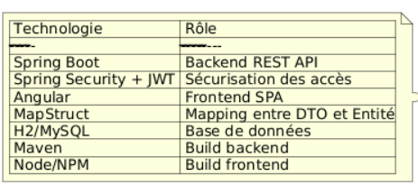
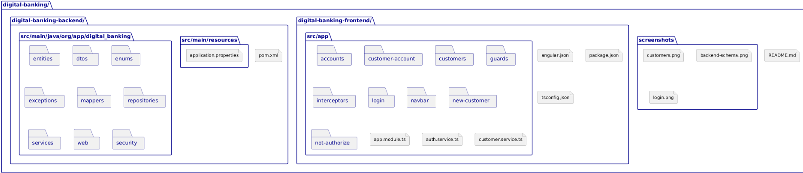
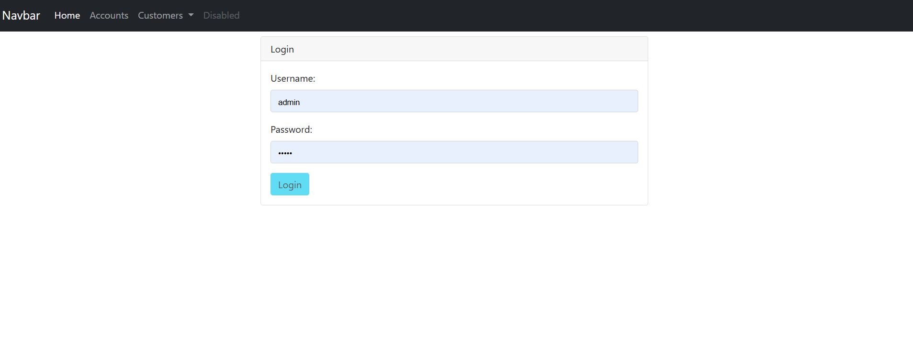
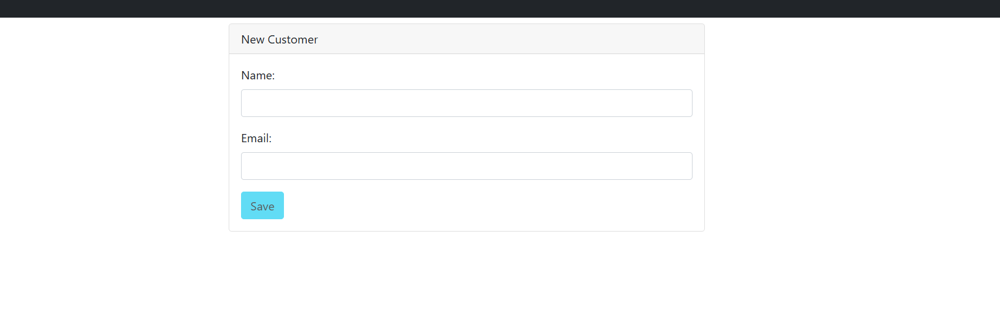
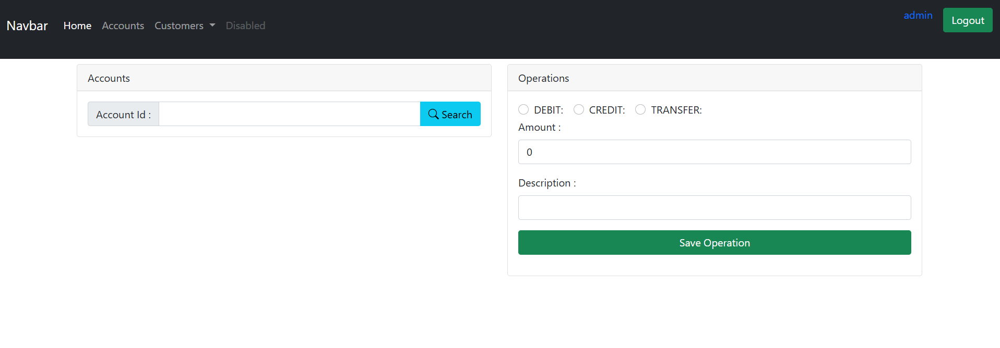

#  Digital Banking - Full Stack App

Ce projet est une application web de gestion bancaire développée avec **Spring Boot** pour le backend et **Angular** pour le frontend.  
Il permet de gérer les clients, leurs comptes bancaires, et d'assurer la sécurité des accès via JWT.

---

## Fonctionnalités principales

- 🔐 Authentification sécurisée avec JWT
- 👤 Gestion des clients
- 💰 Consultation des comptes
- 💳 Opérations bancaires (débit, crédit, virement)
- 🔎 Recherche de clients
- ⚙️ Interface utilisateur réactive (Angular)

---

## 🧱 Architecture du projet

### 🖥️ Frontend – Angular

- `customers` : Liste des clients
- `accounts` : Détails des comptes d’un client
- `customer-account` : Informations d’un client et de ses comptes
- `new-customer` : Formulaire d’ajout
- `login` : Page d’authentification
- `navbar` : Barre de navigation
- `not-authorize` : Page d'accès refusé
- `guards` : Protection des routes
- `interceptors` : Injection automatique du token JWT


### 🧩 Services utilisés

- `auth.service.ts` : Authentification et gestion du token
- `customer.service.ts` : Communication avec l’API Spring Boot

---

### 🔙 Backend – Spring Boot

- `Entities` : `Customer`, `BankAccount`, `SavingAccount`, `CurrentAccount`
- `DTOs` : `CustomerDTO`, `AccountDTO`
- `Repositories` : Interfaces JPA
- `Mappers` : Conversion Entity <-> DTO (via MapStruct)
- `Services` : Logique métier
- `Controllers` : Exposition des APIs REST
- `Security` : JWT + Spring Security (avec filtres, UserDetailsService, etc.)


---

## 🔐 Authentification JWT

- `POST /auth/login` → Retourne un JWT si les identifiants sont valides
- Le token est utilisé dans toutes les requêtes suivantes (header `Authorization`)
- Rôles : `ADMIN`, `USER`
- Routes sécurisées par `SecurityFilterChain`

📷 **Capture d’écran de la page de login**  
> _(Insère ici une image de la page login)_


---

## ⚙️ Technologies utilisées



---

## 🛠️ Lancer le projet

### Backend
```bash
cd digital-banking

Frontend
cd digital-banking-frontend
npm install
ng serve

### Arborescence


### Capture d'écran finale

---


---
