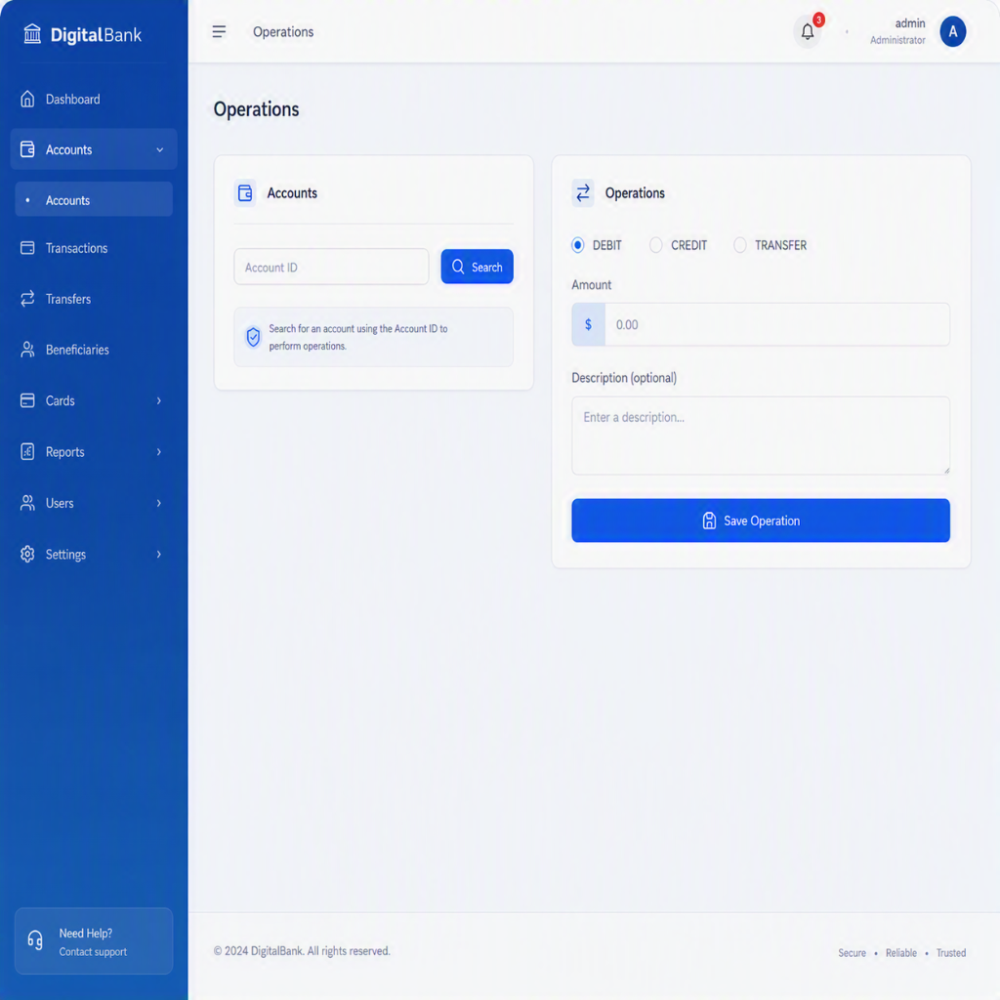
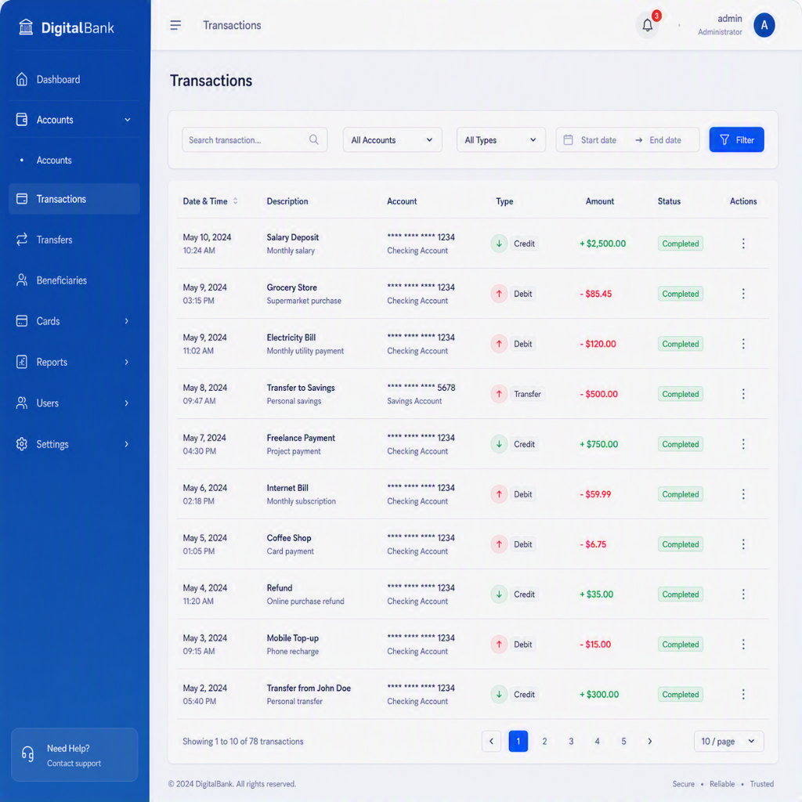

# Digital Banking - Full Stack App

Digital Banking est une application web de gestion bancaire développée avec **Spring Boot** pour le backend et **Angular** pour le frontend.

L'application permet de gérer les clients et leurs comptes bancaires, ainsi que d'effectuer différentes opérations comme les crédits, les débits et les virements. L'accès à l'application est sécurisé avec **Spring Security et JWT**.

## Objectif du projet

L'objectif de ce projet était de mettre en pratique le développement d'une application Full Stack avec Spring Boot et Angular, en travaillant notamment sur la création d'API REST, la gestion des données avec JPA, la sécurité avec JWT et l'intégration entre le frontend et le backend.

## Fonctionnalités

* Authentification avec JWT
* Gestion des clients
* Consultation des comptes bancaires
* Crédit et débit d'un compte
* Virements entre comptes
* Recherche de clients
* Gestion des rôles `ADMIN` et `USER`
* Protection des routes Angular
* Gestion des accès côté backend

## Architecture du projet

### Frontend - Angular

Le frontend est organisé en plusieurs composants :

* `customers` : affichage et recherche des clients
* `accounts` : affichage des comptes d'un client
* `customer-account` : informations du client et de ses comptes
* `new-customer` : formulaire d'ajout d'un client
* `login` : page de connexion
* `navbar` : navigation de l'application
* `not-authorize` : page affichée lorsque l'utilisateur n'a pas les droits nécessaires
* `guards` : protection des routes
* `interceptors` : ajout du token JWT aux requêtes HTTP

Les principaux services Angular sont :

* `auth.service.ts` : gestion de l'authentification et du token
* `customer.service.ts` : communication avec les API du backend

### Backend - Spring Boot

Le backend suit une organisation en différentes couches :

* `Entities` : `Customer`, `BankAccount`, `SavingAccount`, `CurrentAccount`
* `DTOs` : `CustomerDTO`, `AccountDTO`
* `Repositories` : accès aux données avec Spring Data JPA
* `Mappers` : conversion entre les entités et les DTO avec MapStruct
* `Services` : gestion de la logique métier
* `Controllers` : exposition des API REST
* `Security` : configuration de Spring Security et gestion des JWT

## Authentification et sécurité

L'application utilise JWT pour sécuriser les accès.

Lorsqu'un utilisateur se connecte avec ses identifiants, le backend vérifie les informations et génère un token JWT. Ce token est ensuite envoyé avec les requêtes suivantes afin de vérifier que l'utilisateur est bien authentifié.

Deux rôles sont utilisés dans l'application :

* `ADMIN`
* `USER`

Les routes sont protégées côté backend avec Spring Security et côté frontend avec des guards Angular.

## Technologies utilisées

### Backend

* Java
* Spring Boot
* Spring Security
* Spring Data JPA
* Hibernate
* JWT
* MapStruct
* REST API

### Frontend

* Angular
* TypeScript
* HTML
* CSS


## Installation

### Backend

```bash
cd digital-banking
```

Lancer ensuite l'application Spring Boot depuis votre IDE ou avec Maven.

### Frontend

```bash
cd digital-banking-frontend
npm install
ng serve
```


### Aperçu

---



